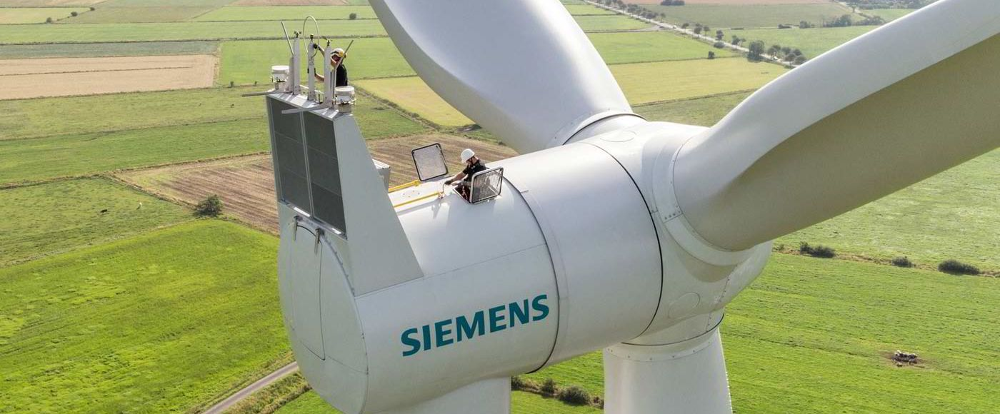
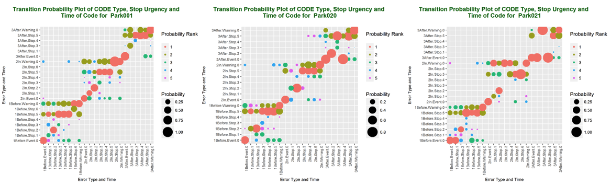
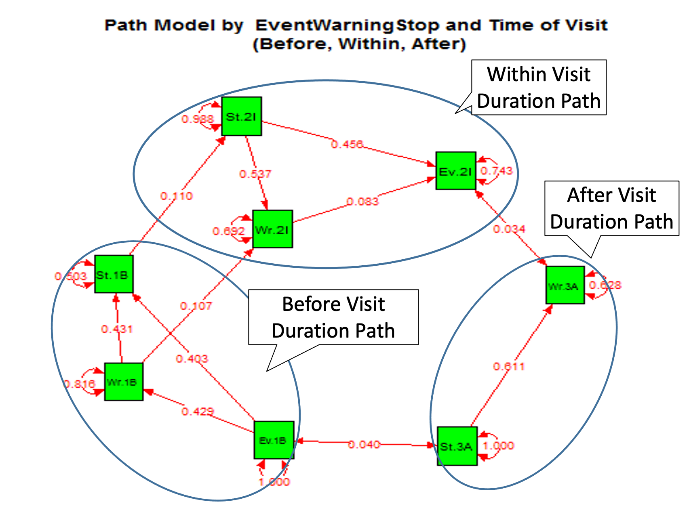

# SIEMENS Wind Competition Data Analysis Project

🏆 **First Prize Winner - SIEMENS 2017 WIND ANALYTICS CONTEST, UCF**

## 🏆 Competition Objective  

The **Siemens 2017 Wind Analytics Contest** aimed to analyze wind turbine operational data to uncover patterns leading to maintenance visits. Wind turbines generate logs of events, warnings, and faults, some causing shutdowns that require technician intervention.  


### 🔹 Key Goals:
This project focuses on identifying patterns and trends in wind turbine failures using data-driven methods:
- **Detect failure patterns** by analyzing pre-visit alarm sequences.
- **Cluster and classify** turbine visit occurrences.
- **Analyze warning and shutdown frequencies** for predictive insights.
- **Identify correlations** between turbine events and technician visits.
  
This project applies **statistical and machine learning techniques** to enhance **predictive maintenance strategies**, improving wind turbine reliability and efficiency.  

## Overview

📌 **Read the report for detailed analysis.**

This project analyzes wind turbine error patterns using various statistical and data mining techniques to detect associations and predict failures. The dataset comprises error codes recorded across multiple wind parks before, during, and after technician visits.

The analysis includes:

- **Exploratory Data Analysis (EDA)** to examine statistical distributions and associations between parks, turbines, and error codes.
- **Markov Chain Model** for estimating conditional probabilities of error transitions, helping predict future failures.

  <p align="center">
    
  </p>

- **Path Analysis** to understand how different error types influence each other over time. This model illustrates sequences such as how event-related errors can lead to stop warnings before, during, and after visits.

  <p align="center">
    
  </p>

- **Clustering Approaches** to categorize parks, stations, and visits based on error patterns.
- **Social Network Analysis** to find the most central error codes and community interactions.
- **Pattern Mining & Sequential Rules** to uncover common error sequences and predict maintenance needs.

These insights support predictive maintenance by helping experts understand failure patterns and optimize turbine servicing.


## Code Files

1. **main.R**
   - Main analysis file
   - Runtime: ~30 minutes (Intel i7, 16GB RAM)
   - Requirements:
     - Change file paths and names at beginning of file
     - May need to install additional R packages
   - Outputs: Various plots and transition matrices

2. **Cluster.R**
   - Contains clustering and social network analysis
   - Requirements:
     - Set `path1` variable to data directory
     - Load 7 transition matrices (can be generated from main.R)
     - Load 3 original datasets
     - Load "Kcode.csv" (manual error code grouping)
   - Recommended to run step-by-step (Parts 1-13) for clarity.
   - Runtime: Few seconds per part
   - Outputs: Plots, graphs, CSV tables

3. **SPatterns.R**
   - Sequential pattern mining analysis
   - Requirements:
     - Change `path1` to data folder
   - Runtime: ~30 minutes
   - Outputs: R tables
   - Progress indicator included in loop

4. **ASRM.R**
   - Association rule mining
   - Runtime: ~5 minutes
   - Outputs: Graphs and R tables

5. **Association test and ANOVA-LSD-Boxplot**
   - Statistical analysis
   - Requirements:
     - Update data import directory
     - Uses Visit_data and Pattern_data with new variables
   - Runtime: Several hours

## Required Datasets

Place these in your data directory:
- All_Sites_Together_encoded.csv
- Codes_and_Event_Warning_Stop_classification.csv
- reccode.csv
- recvis.csv
- Kcode.csv
- Generated transition matrices

## Dependencies

Required R packages:
```r
stringr
arules
reshape2
ggplot2
lavaan
semPlot
mnlogit
mlogit
AER
nnet
```

## Running Order

While files can be run independently using provided datasets, the recommended order is:
1. main.R (generates transition matrices)
2. Cluster.R
3. SPatterns.R
4. ASRM.R
5. Association tests and ANOVA analysis

## Output Structure

The code will generate outputs in two main directories:
- `/Output/table/` - For data tables and CSV files
- `/Output/Plot/` - For generated plots and visualizations

Make sure these directories exist or modify the paths in the code accordingly.

## ⚠️ Data Availability
**Important:** The wind turbine data used in this analysis is **proprietary** and belongs to **Siemens Energy**.  
Due to **confidentiality agreements**, the original datasets **cannot be shared**.  
However, the code is provided for **educational and demonstration purposes**.


## Team Members
(Listed alphabetically)
- Mahsa Almaeenejad
- Kanak Choudhury
- **Jibanul Haque**
- Taha Mokfi
