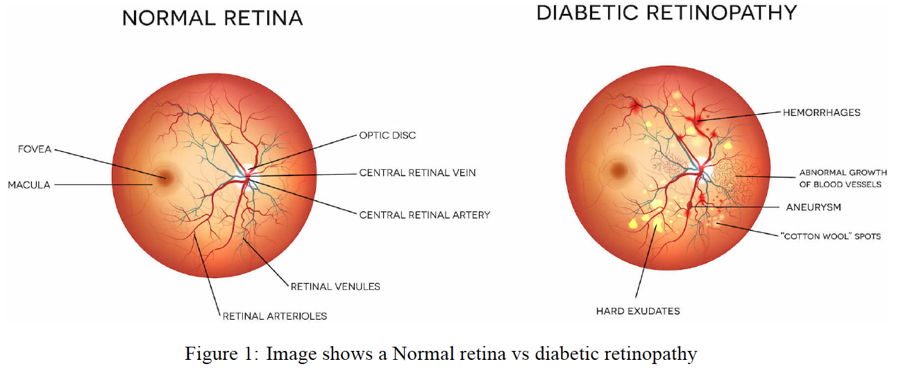

# Diabetic Retinopathy Detection

## Overview

This project implements a deep learning system for the automated classification of Diabetic Retinopathy (DR) severity from retinal fundus images. The model categorizes DR into five stages: No DR, Mild, Moderate, Severe, and Proliferative DR.

<p align="center">
    
</p>

## Contents

- [Key Features](#key-features)
- [Installation](#installation)
- [Data Preparation](#data-preparation)
- [Usage](#usage)
  - [Training](#training)
  - [Inference](#inference)
- [Model Performance](#model-performance)
- [Project Structure](#project-structure)
- [Monitoring Training](#monitoring-training)
- [Challenges and Solutions](#challenges-and-solutions)
- [Acknowledgments](#acknowledgments)

## Key Features

- Multiple model architectures support (ResNet18, EfficientNet-B4/B5, Custom architectures)
- Training pipeline with data augmentation and balanced sampling
- Evaluation metrics including Quadratic Weighted Kappa
- Test-time augmentation and model ensemble capabilities
- TensorBoard integration for training visualization

## Installation

1. Create and activate a virtual environment:
```bash
python -m venv venv
source venv/bin/activate
```

2. Install required packages:
```bash
pip install -r requirements.txt
```

3. Prepare your environment:
```bash
mkdir -p project/data/{train,val,test}
mkdir -p project/{plots,checkpoint,runs,reports}
```

## Data Preparation

1. Download the dataset from [Kaggle Diabetic Retinopathy Detection Challenge](https://www.kaggle.com/c/diabetic-retinopathy-detection)

2. Organize the data in the following structure:
```
project/
└── data/
    ├── train/
    │   ├── 0/  # No DR
    │   ├── 1/  # Mild
    │   ├── 2/  # Moderate
    │   ├── 3/  # Severe
    │   └── 4/  # Proliferative DR
    ├── val/    # Same structure as train
    └── test/   # Same structure as train
```

## Usage

### Training

1. Configure your model in `config.py`:
```python
MODEL = 'resnet18'  # Options: resnet18, efficientnet-b4, efficientnet-b5
BALANCED = True     # Enable balanced sampling
DEVICE = 'cuda:0'   # Use 'cpu' if no GPU available
```

2. Start training:
```bash
python train.py
```

The training progress will be saved in:
- Model checkpoints: `project/checkpoint/<model_name>/<timestamp>/`
- TensorBoard logs: `project/runs/<model_name>/<timestamp>/`
- Confusion matrices: `project/plots/<model_name>/<timestamp>/`
- Classification reports: `project/reports/<model_name>/<timestamp>/`

### Inference

1. For single model inference:
```bash
python inference.py -test_on_val  # Test on validation set
python inference.py               # Test on test set
```

2. For ensemble inference (combines predictions from multiple models):
```bash
python inference.py -ensemble -test_augm
```

Additional options:
- `-test_augm`: Enable test-time augmentation for better accuracy
- `-move_thr`: Apply threshold moving for class balancing
- `-test_on_val`: Run inference on validation set instead of test set

## Model Performance

| Experiment | Accuracy | Quadratic Kappa |
|------------|----------|-----------------|
| EfficientNet-B5 | 79.67% | 0.8935 |
| Ensemble (EfficientNet-B5) | 80.49% | 0.8951 |

## Project Structure

```
.
├── data_loader/         # Data loading utilities
├── models/             # Model architectures
├── trainer/            # Training loop implementation
├── config.py          # Configuration parameters
├── train.py           # Training script
├── inference.py       # Inference script
└── utils.py           # Utility functions
```

## Monitoring Training

Track training progress using TensorBoard:
```bash
tensorboard --logdir=runs
```

## Challenges and Solutions

1. **Class Imbalance**: The dataset showed significant imbalance between different DR severity levels.
   - Solution: Implemented balanced sampling using `ImbalancedDatasetSampler`
   - Result: Improved model performance on minority classes (Severe and Proliferative DR)

2. **Model Architecture Selection**: 
   - Tested multiple architectures (ResNet18, EfficientNet-B4/B5, Custom CNN)
   - EfficientNet-B5 showed best single-model performance (79.67% accuracy)
   - Ensemble of top models achieved highest performance (80.49% accuracy)

3. **Training Optimization**:
   - Implemented learning rate warm-up for first 15 epochs
   - Used adaptive learning rates with MultiStepLR scheduler
   - Applied test-time augmentation for better inference results

4. **GPU Memory Constraints**:
   - EfficientNet-B5 required significant GPU memory, especially with larger batch sizes
   - Solutions implemented:
     - Used mixed precision training with torch.cuda.amp
     - Used gradient checkpointing for ResNet models
     - Added gradient accumulation (ACCUMULATION_STEPS = 4) to simulate larger batches
     - Optimized data loading with controlled worker processes and adjusted batch size
   - Results:
     - Successfully trained EfficientNet-B5 on limited GPU resources
     - Maintained stable training across different model architectures


## Team

This project was developed as part of the **CAP5610 - Machine Learning** course. The team members include:

- **Jibanul Haque**
- **Natnael Daba**
- **Moazam Soomro**


## Acknowledgments

- Dataset provided by [Kaggle and EyePACS](https://www.kaggle.com/c/diabetic-retinopathy-detection)
